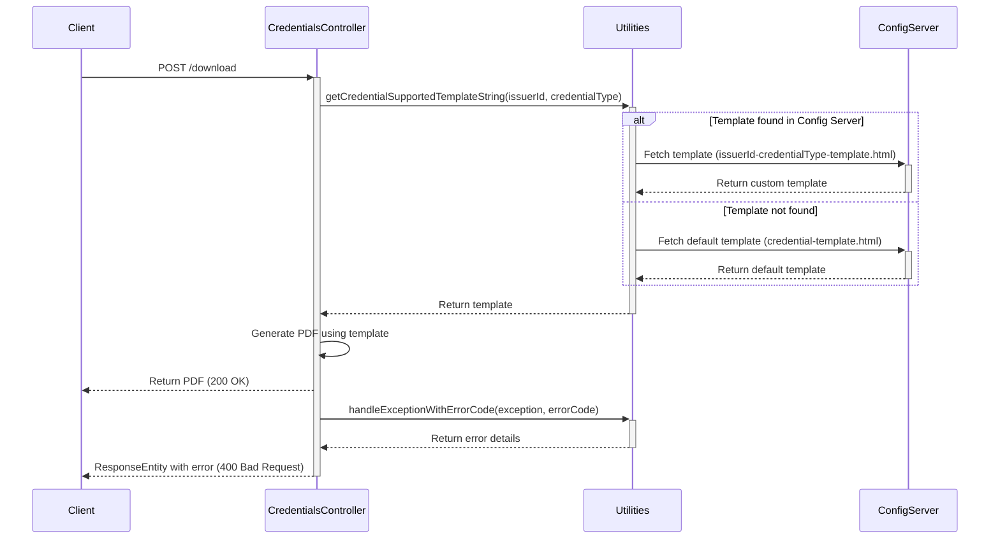

# Download Custom Credential Templates

## Overview
This feature provides option to download a Verifiable Credential (VC) as a PDF using custom templates.
The templates is fetched from a configuration server. Code first tries to find a template using the pattern `issuerId-credentialType-template.html`.
If this specific template is not found, it will use `credential-template.html`.

## Sequence Diagram

## Custom Template Samples

Below are the links to the custom template samples that you can use:

- [Stay Protected Insurance Credential Template](https://github.com/mosip/inji-config/blob/release-0.7.x/StayProtected-InsuranceCredential-template.html)
- [Mosip Verifiable Credential Template](https://github.com/mosip/inji-config/blob/release-0.7.x/Mosip-MosipVerifiableCredential-template.html)

You can view and download the templates from the links above. Feel free to explore and customize them as per your requirements.