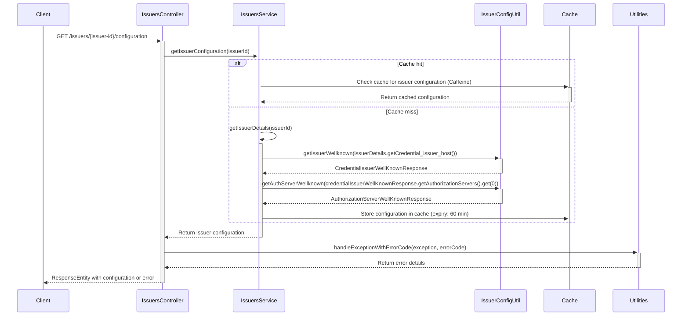

# Issuer Configuration Feature

## Overview

This feature offers an endpoint to fetch the configuration of a credential issuer. 
The configuration is retrieved from both the issuer's well-known endpoint and the authorization server's well-known
endpoint. To enhance performance and minimize the load on external services, the results are cached using Caffeine.
This endpoint is invoked in inji-web when an issuer is selected, allowing its configurations to be retrieved.

## Sequence Diagram

The following sequence diagram illustrates the flow of the `getIssuerConfiguration` method in the `IssuersController` class,
including interactions with the `IssuersService`, `IssuerConfigUtil`, `Utilities` and caching mechanisms.



## Configuration

### Cache Configuration

The caching mechanism used in this project is Caffeine. Cache timeout properties are defined in the
`application-local.properties` file for the local setup, and in the `mimoto-default.properties` file for the environment setup.

#### Cache Timeout Properties

- `cache.credential-issuer.wellknown.expiry-time-in-min`: Cache expiry time in minutes for the issuer's well-known endpoint response.
- `cache.issuers-config.expiry-time-in-min`: Cache expiry time in minutes for issuers configurations read from a config file.
- `cache.credential-issuer.authserver-wellknown.expiry-time-in-min`: Cache expiry time in minutes for the authentication server's well-known endpoint response.
- `cache.default.expiry-time-in-min`: Default cache expiry time in minutes for other cache types.

### Increasing Cache Time

To increase the cache time, you can modify the properties in the `application-local.properties` or
`mimoto-default.properties` file. For example, to set the cache expiry time to 120 minutes, update the properties as follows:

```properties
# Cache expiry time in minutes for the issuer's well-known endpoint response.
cache.credential-issuer.wellknown.expiry-time-in-min = 120
# Cache expiry time in minutes for issuers configurations read from a config file.
cache.issuers-config.expiry-time-in-min = 120
# Cache expiry time in minutes for the authentication server's well-known endpoint response.
cache.credential-issuer.authserver-wellknown.expiry-time-in-min = 120
# Default cache expiry time in minutes for other cache types.
cache.default.expiry-time-in-min = 120
```