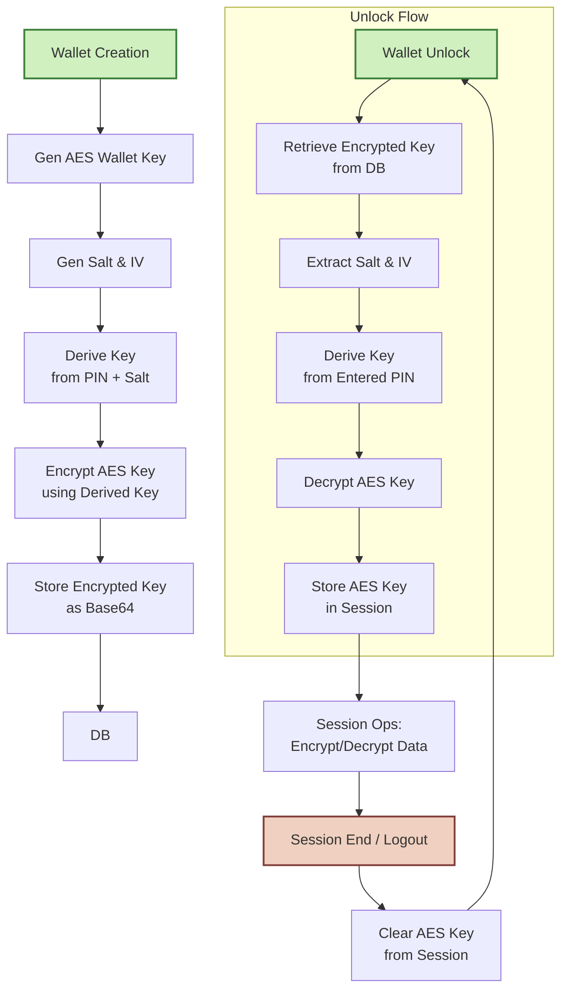

## Securing User Data in the Mimoto Database with PIN-derived Key Encryption


## Overview of Encryption Requirement and Goals

The encryption mechanism is designed to protect sensitive data stored in the database, such as wallet keys and user metadata. The primary goals are:

- Ensuring confidentiality of sensitive data.
- Preventing unauthorized access to sensitive information.
- Supporting secure key management and retrieval processes.
- Enabling record-level encryption for granular security.

## Encryption Algorithm and Mode Used

- **Algorithm:** AES (Advanced Encryption Standard)
- **Key Size:** 256 bits
- **Mode:** AES-256 GCM

## Key Management Strategy

- **Key Generation:** The AES key is generated dynamically during wallet creation.
- **Key Encryption:** The AES key is encrypted using the wallet PIN provided by the user.
- **Key Storage:** The encrypted AES key is stored securely in the database.
- **Key Retrieval:** During wallet unlocking, the wallet PIN is used to decrypt the AES key.

## Record-Level Encryption Design

- Each sensitive record (e.g., user signing keys) is encrypted using a unique AES key for a user.
- The AES key itself is encrypted using the wallet PIN, ensuring that only the user with the correct PIN can access the data.
---
# Wallet Key Lifecycle

### 1. 🔧 Wallet Creation
The user submits a POST request with a PIN to create a new wallet.

- The system generates a new 256-bit AES wallet key:
```java
SecretKey aesKey = KeyGenerationUtil.generateEncryptionKey("AES", 256);
```
- A salt (32 bytes) and IV (12 bytes) are generated randomly.
- The user's PIN is used to derive a key using PBKDF2WithHmacSHA512.
- The AES key is encrypted using AES/GCM/NoPadding and stored as:

    ```Base64(salt + IV + ciphertext)```
- The original PIN and AES key are never stored.

### 2. 🔓 **Wallet Unlock (Session Start)**
When the user wants to access the wallet, they re-enter their PIN via an unlock API.

- The system retrieves the encrypted wallet key.
- Extracts the salt and IV.
- Derives the decryption key from the entered PIN and stored salt.
- Decrypts the AES wallet key.
- The decrypted AES key is then Base64-encoded and stored in the HTTP session.
### 3. 🔐 **In-Session Operations**
Once the AES wallet key is in session:
- It is used to encrypt or decrypt sensitive data like credentials or keys.
-  The user does not need to re-enter the PIN during the session.
-  Encryption and decryption continue using AES/GCM/NoPadding for both confidentiality and integrity.

### 4. 🔚 **Session End / Logout**
- The decrypted AES key is removed from the session.
- On the next login, in unlock wallet API, the user must provide their PIN again to decrypt the key.

---

## Flow Diagram


This flow ensures that sensitive user data is securely encrypted and accessible only to the user who knows the PIN.