# Mimoto Database Encryption Documentation

## Table of Contents
- [Overview](#overview)
- [Security Architecture](#security-architecture)
- [Encryption Specifications](#encryption-specifications)
- [Key Management](#key-management)
- [User Data Protection](#user-data-protection)
- [Wallet Lifecycle](#wallet-lifecycle)
- [Implementation Details](#implementation-details)
- [Configuration](#configuration)
- [Troubleshooting](#troubleshooting)

---

## Overview

This document describes the encryption mechanisms implemented in the Mimoto database to protect sensitive user data including wallet keys, credentials, and personally identifiable information (PII).

### Security Goals
- ✅ **Confidentiality**: Protect sensitive data from unauthorized access
- ✅ **Integrity**: Ensure data hasn't been tampered with
- ✅ **Authentication**: Verify data authenticity using authenticated encryption
- ✅ **Granular Security**: Enable record-level encryption for fine-grained access control

---

## Security Architecture

### Two-Tier Encryption Model

1. **User PII Encryption**: Uses application-managed keys from KeyStore
2. **Wallet Data Encryption**: The same PIN-derived AES key is used to encrypt and decrypt both wallet metadata and credentials.

```
┌─────────────────┐    ┌─────────────────┐
│   User PII      │    │  Wallet Keys    │
│                 │    │                 │
│ KeyStore Keys   │    │ PIN-Derived     │
│ (AES-256-GCM)   │    │ Keys (PBKDF2)   │   
└─────────────────┘    └─────────────────┘   
```

---

## Encryption Specifications

### Core Algorithm
- **Encryption**: AES-256-GCM (Galois/Counter Mode)
- **Key Size**: 256 bits
- **IV Size**: 96 bits (12 bytes)
- **Tag Size**: 128 bits (16 bytes)

### Key Derivation (for PIN-based encryption)
- **Function**: PBKDF2WithHmacSHA512
- **Iterations**: ≥10,000
- **Salt Size**: 256 bits
- **Output Key**: 256 bits

### Security Properties
- **Authenticated Encryption**: GCM mode provides both confidentiality and integrity
- **Unique IVs**: Generated randomly for each encryption operation
- **No Key Reuse**: Each sensitive record uses appropriate key isolation

---

## Key Management

### KeyStore Integration
The `CryptoManagerService` (provided by KeyManager library) handles:
- Secure key loading from `.p12` KeyStore files
- Key retrieval by reference ID
- Application startup key initialization

### Key Types

| Key Type | Purpose | Derivation | Storage |
|----------|---------|------------|---------|
| **User PII Keys** | Encrypt profile data | KeyStore | Application KeyStore |
| **Wallet Keys** | Encrypt wallet data & credentials | PIN + PBKDF2 | Database (encrypted) + Session (Base64) |

**Note**: Wallet keys exist in two states:
- **Persistent**: Encrypted with PIN-derived key, stored in database
- **Temporary**: Same key Base64-encoded in HTTP session during active user session

---

## User Data Protection

### PII Encryption Process
User personally identifiable information is encrypted using keys managed by the KeyManager library:

- **Reference ID**: `"user_pii"`
- **Fields Protected**: Display name, email, profile picture URL
- **Key Management**: Automatic via KeyStore integration

### Data Flow
1. OAuth2 login extracts user attributes
2. Existing user data is decrypted for comparison
3. Changed fields are re-encrypted
4. Updated records are saved to database

---

## Wallet Lifecycle

### 1. 🔧 Wallet Creation
```java
// Key generation
SecretKey aesKey = KeyGenerationUtil.generateEncryptionKey("AES", 256);

// Storage format
Base64(salt + IV + ciphertext)
```

**Process:**
1. Generate 256-bit AES wallet key
2. Create random salt (32 bytes) and IV (12 bytes)
3. Derive encryption key from PIN using PBKDF2
4. Encrypt wallet key using derived key
5. Store encrypted key in database

### 2. 🔓 Wallet Unlock (Session Start)
**Process:**
1. Retrieve encrypted wallet key from database
2. Extract salt and IV from stored data
3. Derive decryption key from entered PIN
4. Decrypt wallet key using `keyManager.decryptWithPin()`
5. Store Base64-encoded key in HTTP session

### 3. 🔐 In-Session Operations
- Base64-decode the wallet key from session for encryption/decryption
- Same wallet key used for both wallet metadata and credential operations
- No PIN re-entry required during session
- All operations use AES-256-GCM

### 4. ⏰ Session Management
- **Default Timeout**: 30 minutes
- **Configurable**: Via `server.servlet.session.timeout`
- **Auto-cleanup**: Session key removed on timeout

### 5. 🔚 Session End
- Remove Base64-encoded wallet key from session
- Require PIN for next unlock (to decrypt the same wallet key)
- Secure memory cleanup

---

## Implementation Details

### Sequence Diagrams

#### User PII Encryption Flow

```mermaid
sequenceDiagram
    participant User
    participant CustomOAuth2UserService
    participant UserMetadataService
    participant UserMetadataRepository
    participant EncryptionDecryptionUtil
    participant CryptoManagerService as CryptoManagerService<br/>(by KeyManager library)

    Note over EncryptionDecryptionUtil,CryptoManagerService: 🔐 Symmetric Encryption:<br/>Algorithm: AES/GCM/NoPadding<br/>Key length: 256 bits<br/>GCM Tag Length: 128 bits<br/>Reference ID: "user_pii"<br/>AAD = "", Salt = ""
    Note over CryptoManagerService: 🔑 Keys are securely loaded from <br/>a KeyStore (.p12 file)<br/>on application startup or key access
    User->>CustomOAuth2UserService: Login via OAuth2 provider (e.g., Google)
    CustomOAuth2UserService->>CustomOAuth2UserService: Extract attributes (name, email, picture, etc.)
    CustomOAuth2UserService->>UserMetadataService: updateOrCreateUserMetadata(providerSubjectId, IDP, name, picture, email)

    UserMetadataService->>UserMetadataRepository: findByProviderSubjectIdAndIdentityProvider()
    UserMetadataRepository-->>UserMetadataService: existingUser? (encrypted fields)

    alt User Exists
        UserMetadataService->>EncryptionDecryptionUtil: decrypt(displayName, "user_pii", "", "")
        EncryptionDecryptionUtil->>CryptoManagerService: getSymmetricKey("user_pii")
        CryptoManagerService-->>EncryptionDecryptionUtil: AES key
        EncryptionDecryptionUtil-->>UserMetadataService: decryptedDisplayName

        UserMetadataService->>EncryptionDecryptionUtil: decrypt(profilePictureUrl, "user_pii", "", "")
        EncryptionDecryptionUtil->>CryptoManagerService: getSymmetricKey("user_pii")
        CryptoManagerService-->>EncryptionDecryptionUtil: AES key
        EncryptionDecryptionUtil-->>UserMetadataService: decryptedProfilePictureUrl

        UserMetadataService->>EncryptionDecryptionUtil: decrypt(email, "user_pii", "", "")
        EncryptionDecryptionUtil->>CryptoManagerService: getSymmetricKey("user_pii")
        CryptoManagerService-->>EncryptionDecryptionUtil: AES key
        EncryptionDecryptionUtil-->>UserMetadataService: decryptedEmail

        UserMetadataService->>UserMetadataService: compare with input, encrypt if changed

        UserMetadataService->>EncryptionDecryptionUtil: encrypt(updatedField, "user_pii", "", "")
        EncryptionDecryptionUtil->>CryptoManagerService: getSymmetricKey("user_pii")
        CryptoManagerService-->>EncryptionDecryptionUtil: AES key
        EncryptionDecryptionUtil-->>UserMetadataService: encryptedField

        UserMetadataService->>UserMetadataRepository: save(updated UserMetadata)
        UserMetadataRepository-->>UserMetadataService: saved userId
    else New User
        UserMetadataService->>EncryptionDecryptionUtil: encrypt(displayName, "user_pii", "", "")
        EncryptionDecryptionUtil->>CryptoManagerService: getSymmetricKey("user_pii")
        CryptoManagerService-->>EncryptionDecryptionUtil: AES key
        EncryptionDecryptionUtil-->>UserMetadataService: encryptedDisplayName

        UserMetadataService->>EncryptionDecryptionUtil: encrypt(profilePictureUrl, "user_pii", "", "")
        EncryptionDecryptionUtil->>CryptoManagerService: getSymmetricKey("user_pii")
        CryptoManagerService-->>EncryptionDecryptionUtil: AES key
        EncryptionDecryptionUtil-->>UserMetadataService: encryptedProfilePictureUrl

        UserMetadataService->>EncryptionDecryptionUtil: encrypt(email, "user_pii", "", "")
        EncryptionDecryptionUtil->>CryptoManagerService: getSymmetricKey("user_pii")
        CryptoManagerService-->>EncryptionDecryptionUtil: AES key
        EncryptionDecryptionUtil-->>UserMetadataService: encryptedEmail

        UserMetadataService->>UserMetadataRepository: save(new UserMetadata)
        UserMetadataRepository-->>UserMetadataService: saved userId
    end

    UserMetadataService-->>CustomOAuth2UserService: return userId
    CustomOAuth2UserService-->>User: login success (userId/session)
```


#### Wallet Creation Flow

```mermaid
sequenceDiagram
participant WalletService
participant WalletUtil
participant EncryptionDecryptionUtil
participant CryptoManagerService
participant WalletRepository as Database

    Note over WalletUtil,EncryptionDecryptionUtil: 🔐 Encryption Algorithm<br/>AES/GCM/NoPadding (256-bit key)<br/>IV: 96-bit, Tag: 128-bit

    Note over EncryptionDecryptionUtil,CryptoManagerService: 🔁 Key Derivation Function<br/>PBKDF2WithHmacSHA512<br/>Iterations: ≥10,000<br/>Salt: 128-bit<br/>Output key: 256-bit

    WalletService->>WalletUtil: createWallet(userId, walletName, pin)
    WalletUtil->>WalletUtil: generateEncryptionKey(algorithm=AES, keySize=256)
    WalletUtil->>EncryptionDecryptionUtil: encryptKeyWithPin(secretKey, pin)

    EncryptionDecryptionUtil->>CryptoManagerService: deriveKeyFromPin(pin, salt, iterations)
    CryptoManagerService-->>EncryptionDecryptionUtil: derivedKey (AES 256-bit)

    EncryptionDecryptionUtil->>CryptoManagerService: encryptAESGCM(secretKey, derivedKey, iv)
    CryptoManagerService-->>EncryptionDecryptionUtil: encryptedWalletKey (IV + Tag + Ciphertext)

    EncryptionDecryptionUtil-->>WalletUtil: encryptedWalletKey

    WalletUtil->>WalletRepository: saveWallet(userId, walletName, encryptedWalletKey, metadata, signingKeys)
    WalletRepository-->>WalletUtil: walletId
    WalletUtil-->>WalletService: walletId
```


#### Wallet Credential Encryption Flow

```mermaid
sequenceDiagram
    participant CredentialProcessor
    participant WalletRepository
    participant Database
    participant EncryptionDecryptionUtil
    participant WalletCredentialsRepository

    Note over EncryptionDecryptionUtil: 🔐 AES/GCM/NoPadding with walletKey (256-bit)<br/>Key is passed as Base64, decoded, used directly

    CredentialProcessor->>WalletRepository: getWallet(walletId)
    WalletRepository->>Database: SELECT * FROM Wallet WHERE walletId = ?
    Database-->>WalletRepository: Wallet with walletKey (Base64 encoded)
    WalletRepository-->>CredentialProcessor: encryptedWalletKey (Base64)

    CredentialProcessor->>EncryptionDecryptionUtil: encryptCredential(vcJson, encryptedWalletKey)
    EncryptionDecryptionUtil-->>CredentialProcessor: encryptedCredentialData

    CredentialProcessor->>WalletCredentialsRepository: saveCredential(walletId, encryptedCredentialData)
    WalletCredentialsRepository->>Database: INSERT credential
    Database-->>WalletCredentialsRepository: Success
```


### Complete Wallet Lifecycle Flow


---

## Configuration

### Session Timeout
```properties
# application-default.properties
server.servlet.session.timeout=30m
```

### PBKDF2 Parameters
```properties
mosip.kernel.crypto.hash-iteration = 10000 // Minimum iterations
mosip.kernel.crypto.gcm-tag-length=128 // GCM tag length in bits
mosip.kernel.crypto.hash-symmetric-key-length=256 // Symmetric key length in bits
```

### KeyStore Configuration
- **Format**: PKCS#12 (.p12)
- **Loading**: Application startup or on-demand
- **Key Access**: Via reference ID system

---

## Troubleshooting

### Common Issues

#### Session Timeout
**Problem**: User session expires unexpectedly
**Solution**:
- Check `server.servlet.session.timeout` configuration
- Verify session activity is maintaining the session
- Consider adjusting timeout value based on usage patterns

#### PIN Validation Failures
**Problem**: Cannot decrypt wallet with correct PIN
**Solution**:
- Verify salt and IV extraction from stored data
- Check PBKDF2 iteration count consistency
- Ensure PIN encoding/decoding is consistent

#### KeyStore Access Issues
**Problem**: Cannot load keys from KeyStore
**Solution**:
- Verify .p12 file location and permissions
- Check KeyStore password configuration
- Ensure key aliases match reference IDs

#### Encryption/Decryption Errors
**Problem**: Data corruption or decryption failures
**Solution**:
- Verify IV uniqueness for each encryption
- Check GCM tag validation
- Ensure proper Base64 encoding/decoding
