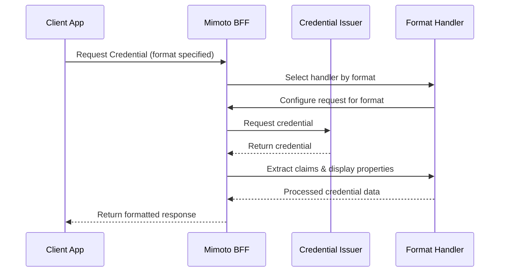

# Adding Support for New VC Formats

## Overview

Mimoto uses a pluggable handler architecture to support multiple Verifiable Credential formats. Add new formats by implementing the `CredentialFormatHandler` interface without modifying core services.

### Key Benefits
- ✅ **Zero Core Changes**: Add formats without touching existing services
- ✅ **Auto-Discovery**: Handlers are automatically registered via Spring
- ✅ **Format Agnostic**: Services work seamlessly across all formats

## Architecture

### Request Flow


### Handler Architecture
```mermaid
classDiagram
    class CredentialFormatHandler {
        <<interface>>
        +getSupportedFormat() String
        +buildCredentialRequest(...) VCCredentialRequest
        +extractCredentialClaims(VCCredentialResponse) Map
        +loadDisplayPropertiesFromWellknown(...) LinkedHashMap
    }
    
    class CredentialFormatHandlerFactory {
        +getHandler(String format) CredentialFormatHandler
        +getSupportedFormats() Set
    }
    
    class VcSdJwtCredentialFormatHandler {
        +getSupportedFormat() String
        +buildCredentialRequest(...) VCCredentialRequest
        +extractCredentialClaims(...) Map
        +loadDisplayPropertiesFromWellknown(...) LinkedHashMap
    }
    
    class LdpVCCredentialFormatHandler {
        +getSupportedFormat() String
        +buildCredentialRequest(...) VCCredentialRequest
        +extractCredentialClaims(...) Map
        +loadDisplayPropertiesFromWellknown(...) LinkedHashMap
    }
    
    CredentialFormatHandlerFactory --> CredentialFormatHandler : manages
    CredentialFormatHandler <|.. VcSdJwtCredentialFormatHandler : implements
    CredentialFormatHandler <|.. LdpVCCredentialFormatHandler : implements```

## Implementation Guide

### 1. Study Existing Handlers

Before implementing, review existing handlers in the codebase:

- **LDP VC Handler**: [`LdpVCCredentialFormatHandler.java`](https://github.com/mosip/mimoto/blob/release-0.19.x/src/main/java/io/mosip/mimoto/service/credentialformatter/LdpVCCredentialFormatHandler.java)
- **Handler Interface**: [`CredentialFormatHandler.java`](https://github.com/mosip/mimoto/blob/release-0.19.x/src/main/java/io/mosip/mimoto/service/credentialformatter/CredentialFormatHandler.java)

### 2. Implement Your Handler

Create a new handler class implementing `CredentialFormatHandler`:

```java
@Component
@Slf4j
public class SDJWTCredentialFormatHandler implements CredentialFormatHandler {
    
    @Override
    public String getSupportedFormat() {
        return "vc+sd-jwt";  // Your format identifier
    }
    
    // Implement remaining methods following patterns from existing handlers
    // See LdpVCCredentialFormatHandler for JSON-LD format reference
}
```

### 3. Handler Registration

Your handler will be auto-discovered by Spring. The factory automatically injects all handlers:

**Reference**: [`CredentialFormatHandlerFactory.java`](https://github.com/mosip/mimoto/blob/release-0.19.x/src/main/java/io/mosip/mimoto/service/credentialformatter/CredentialFormatHandlerFactory.java)

### 4. Update Models (if needed)

For format-specific fields, update:
- **Request Model**: [`VCCredentialRequest.java`](https://github.com/mosip/mimoto/blob/release-0.19.x/src/main/java/io/mosip/mimoto/dto/openid4vci/VCCredentialRequest.java)
- **Response Model**: [`VCCredentialResponse.java`](https://github.com/mosip/mimoto/blob/release-0.19.x/src/main/java/io/mosip/mimoto/dto/openid4vci/VCCredentialResponse.java)

### 5. Services Using Handlers

These services automatically work with your new handler:

| Service | Usage | Reference |
|---------|-------|-----------|
| `CredentialRequestService` | Requests credentials in your format | [Source](https://github.com/mosip/mimoto/blob/release-0.19.x/src/main/java/io/mosip/mimoto/service/CredentialRequestService.java) |
| `CredentialPDFGeneratorService` | Generates PDFs from your format | [Source](https://github.com/mosip/mimoto/blob/release-0.19.x/src/main/java/io/mosip/mimoto/service/CredentialPDFGeneratorService.java) |
