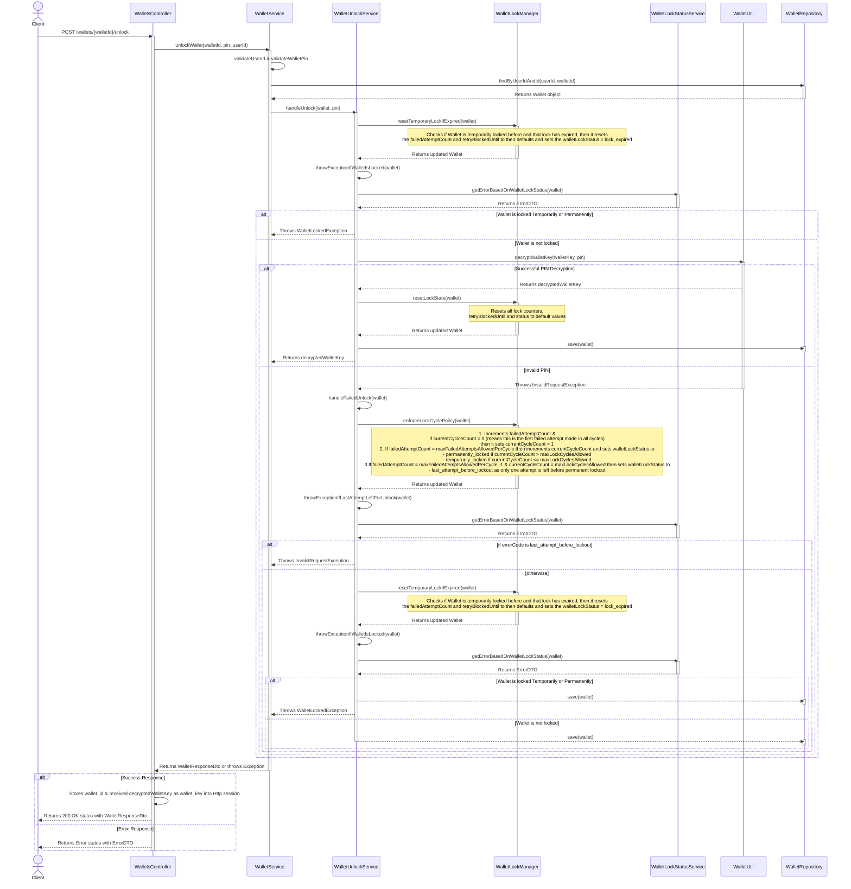

# Wallet Unlock Process with max limit on failed attempts

## Overview

The Wallet Unlock feature provides a secure mechanism to access a user's encrypted wallet using their PIN. This process includes sophisticated security measures such as temporary and permanent locking mechanisms to prevent brute force attacks, along with PIN-based decryption of wallet key. The unlock flow is triggered when a user needs to access their wallet after session expiry or initial login.

## Key Features

- PIN-based wallet unlocking
- Progressive security with temporary and permanent locking
- Configurable failed attempt limits and lock cycles
- Automatic lock expiry for temporary locks
- Session-based wallet key storage
- Last attempt warning before permanent lockout

## Sequence Diagram

The sequence diagram below illustrates the complete unlock process, including validation, PIN verification, and lock management steps.


## Configuration

Configurable properties that govern the entire Passcode flow within the Wallet unlock process are defined in the
`application-local.properties` file for the local setup, and in the `mimoto-default.properties` file for the environment setup.

#### Passcode Control Properties
- `wallet.passcode.retryBlockedUntil`: Duration for which the Wallet remains in temporary lock state (in milliseconds)
- `wallet.passcode.maxFailedAttemptsAllowedPerCycle`: Maximum number of failed attempts allowed before triggering a temporary lock cycle
- `wallet.passcode.maxLockCyclesAllowed`: Maximum lock cycles allowed before permanent lockout

```properties
# Duration (in milliseconds) for which the wallet remains locked after exceeding failed attempts in a cycle
wallet.passcode.retryBlockedUntil=3600000
# Maximum number of failed passcode attempts allowed in a single cycle (defaults to 1 if <=0)
wallet.passcode.maxFailedAttemptsAllowedPerCycle=5
# Maximum number of lock cycles allowed before the wallet is permanently locked (defaults to 1 if <=0)
wallet.passcode.maxLockCyclesAllowed=3
```